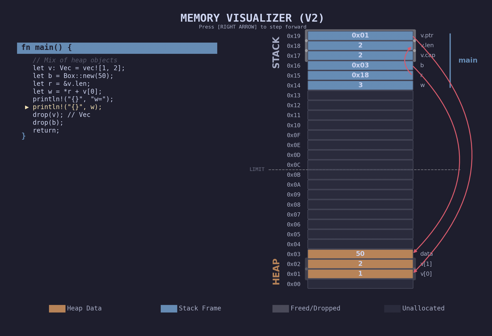
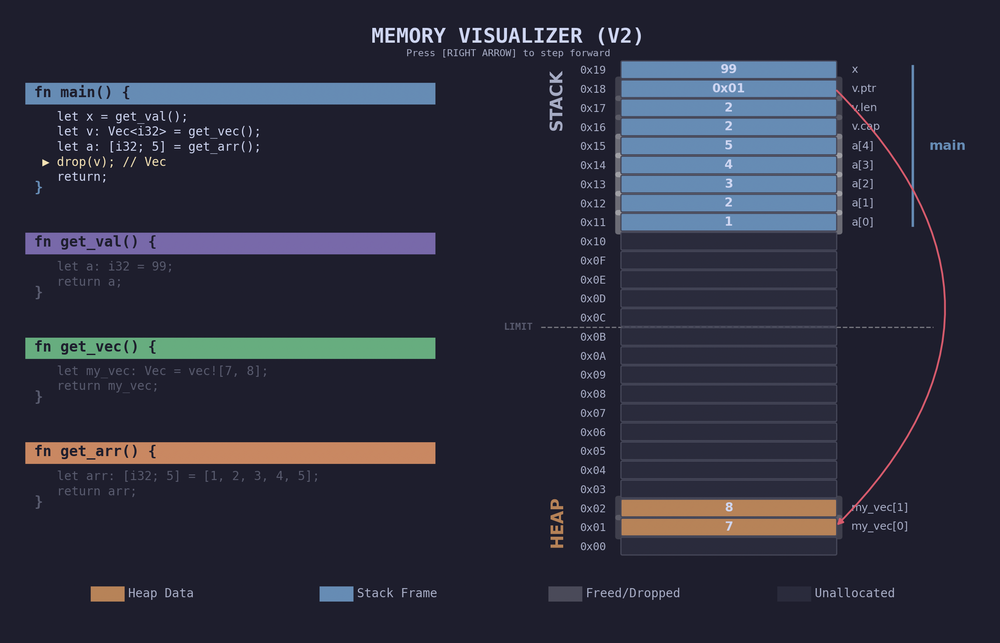

# 🦀 Rust-like Pedagogical Memory Visualizer

A lightweight, interactive Python tool designed to help students visualize **Stack vs. Heap**. This tool simulates how a systems language like Rust/C manages memory without a Garbage Collector, providing a step-by-step graphical trace of memory state changes.

---

## 🖥️ User Interface & Simulation

When you launch the program, you are greeted with a categorized menu of memory illustrations:


Once an illustration is selected, the visualizer opens a window showing the live state of the Stack and Heap:


*The simulation highlights the current line of code, the active stack frames, and dynamic pointers between memory locations.*





Here is a draft for your disclaimer. It balances technical honesty with the fact that this is a pedagogical tool.

---

## ⚠️ Implementation Disclaimer: Educational Simplification

This project is designed as a **conceptual visualizer** to help learners understand the relationship between source code, the stack, and the heap. To maintain clarity, several low-level architectural complexities have been abstracted away:

* **Stack Contents:** In a real-world environment (like x86-64 or ARM), the stack contains much more than just local variables. It includes **return addresses** (saved Instruction Pointers), **frame pointers** (EBP/RBP), and **padding** for memory alignment.
* **Register Usage:** Modern compilers make heavy use of **CPU Registers** (e.g., `rax`, `rbx`) to pass arguments and perform arithmetic. In this visualizer, many operations are shown as direct memory manipulations for better visibility, whereas a real CPU would perform these in registers.
* ...

## 🚀 Getting Started

This project uses [uv](https://github.com/astral-sh/uv) for fast, reliable Python package and dependency management.

### Prerequisites

* [uv](https://docs.astral.sh/uv/getting-started/installation/) installed on your system.
* Python 3.12+ (managed automatically by `uv`).

### Installation & Setup

1. **Clone the repository**:
```bash
git clone git@github.com:maximiliense/MemoryVisualization.git
cd MemoryVisualization

```


2. **Sync dependencies**:
This command creates a virtual environment and installs all necessary dependencies (`matplotlib`) automatically:
```bash
uv sync

```


### Running the Visualizer

To launch the interactive menu, use `uv run`. This ensures the script runs within the correct environment with all dependencies available:

```bash
uv run python main.py

```


## 📝 Writing Your Own Programs

You can define custom scenarios by creating a `Program` object. It uses a custom AST (Abstract Syntax Tree) style:

```python
from visualizer.instructions import StackVar, VecNew, VecPush, ReturnFunction
from visualizer.runner import Program, FunctionDef

def my_custom_prog():
    return Program({
        "main": FunctionDef(
            body=[
                StackVar("x", "i32", 10),
                VecNew("v", [1, 2], cap=2),
                VecPush("v", 3), # Triggers a reallocation!
                ReturnFunction()
            ]
        )
    })

```

---

## ⌨️ Controls

* **[RIGHT ARROW]**: Step forward to the next instruction.
