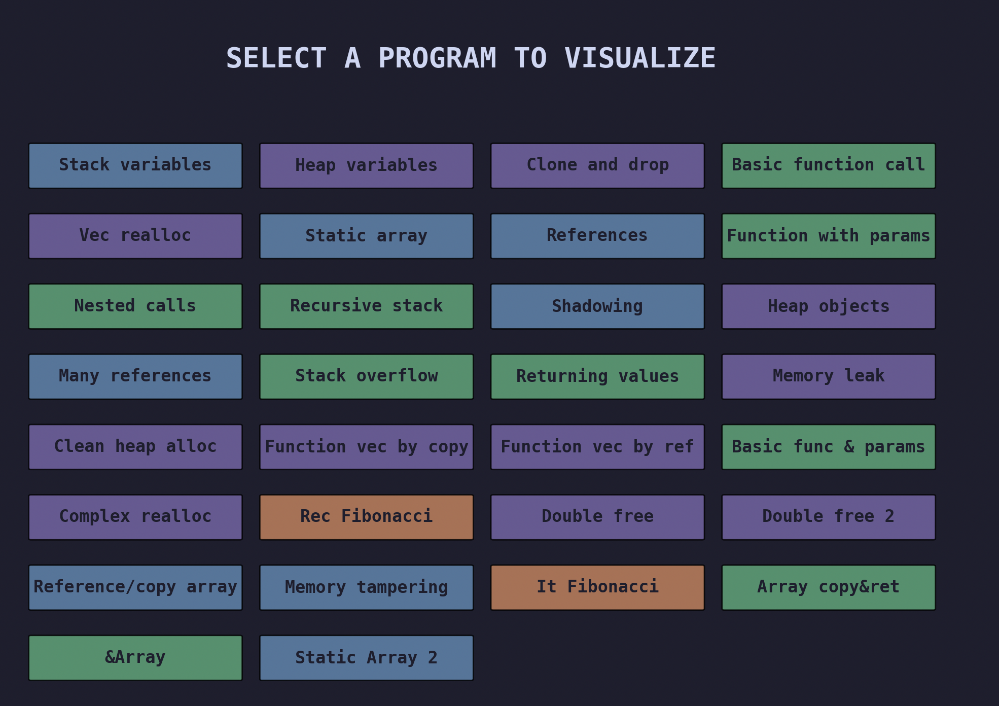
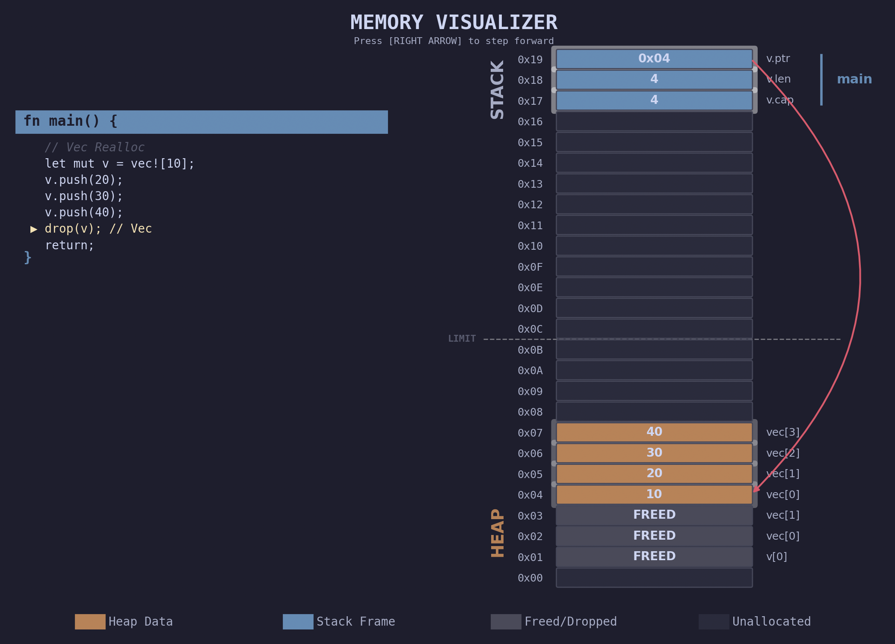

# 🦀 Rust-like Pedagogical Memory Visualizer

A lightweight, interactive Python tool designed to help students visualize **Stack vs. Heap**. This tool simulates how a systems language like Rust/C manages memory without a Garbage Collector, providing a step-by-step graphical trace of memory state changes.

---

## 🖥️ User Interface & Simulation


When you launch the program, you are greeted with a categorized menu of memory illustrations:



Once an illustration is selected, the visualizer opens a window showing the live state of the Stack and Heap:



*The simulation highlights the current line of code, the active stack frames, and dynamic pointers between memory locations.*


## 🚀 Getting Started

### Prerequisites

* Python 3.9+
* `matplotlib`

### Installation

1. Clone the repository.
2. Install the package in editable mode to allow for local imports:

```bash
pip install -e .

```

### Running

To launch the interactive menu:

```bash
python visualizer.py

```

---

## 📝 Writing Your Own Programs

You can define custom scenarios by creating a `Program` object. It uses a custom AST (Abstract Syntax Tree) style:

```python
from visualizer.instructions import StackVar, VecNew, VecPush, ReturnFunction
from visualizer.runner import Program, FunctionDef

def my_custom_prog():
    return Program({
        "main": FunctionDef(
            body=[
                StackVar("x", "i32", 10),
                VecNew("v", [1, 2], cap=2),
                VecPush("v", 3), # Triggers a reallocation!
                ReturnFunction()
            ]
        )
    })

```

---

## ⌨️ Controls

* **[RIGHT ARROW]**: Step forward to the next instruction.
