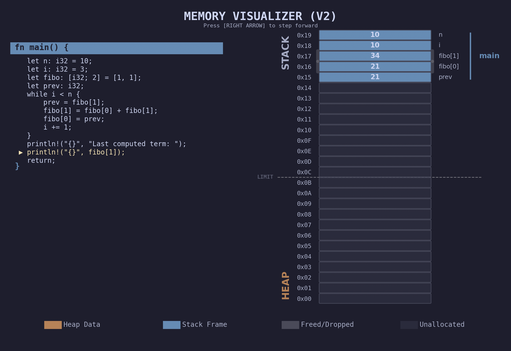

# 🦀 Rust-like Pedagogical Memory Visualizer

A lightweight, interactive Python tool designed to help students visualize **Stack vs. Heap**. This tool simulates how a systems language like Rust/C manages memory without a Garbage Collector, providing a step-by-step graphical trace of memory state changes.

---

## 🖥️ User Interface & Simulation

When you launch the program, you are greeted with a categorized menu of memory illustrations:

Once an illustration is selected, the visualizer opens a window showing the live state of the Stack and Heap:

*The simulation highlights the current line of code, the active stack frames, and dynamic pointers between memory locations.*


---

## ⚠️ Implementation Disclaimer: Educational Simplification

This project is designed as a **conceptual visualizer** to help learners understand the relationship between source code, the stack, and the heap. To maintain clarity, several low-level architectural complexities have been abstracted away:

* **Stack Contents:** In a real-world environment (like x86-64 or ARM), the stack contains more than just local variables. It includes **return addresses**, **frame pointers**, and **padding** for alignment.
* **Register Usage:** Modern CPUs use **Registers** for arithmetic. Here, operations are shown as direct memory manipulations for better visibility.

---

## 🚀 Getting Started

This project uses [uv](https://github.com/astral-sh/uv) for fast, reliable Python package and dependency management.

### Prerequisites

* [uv](https://docs.astral.sh/uv/getting-started/installation/) installed.
* Python 3.10+ (managed automatically by `uv`).

### Installation & Setup

1. **Clone the repository**:

```bash
git clone git@github.com:maximiliense/MemoryVisualization.git
cd MemoryVisualization

```

2. **Sync dependencies**:

```bash
uv sync

```

### Running the Visualizer

To launch the interactive menu:

```bash
uv run python main.py

```

---

## 📝 Examples & Supported Syntax

The visualizer includes a parser that understands a subset of Rust-like syntax (with manual memory management). Below are examples of supported features:

### 1. Vectors, Boxes, and Dropping

Manage heap-allocated memory and manual cleanup.

```rust
fn main() {
    let mut v = vec![10];
    v.push(20);          // Triggers heap reallocation
    let b = Box::new(100);
    *b = 1000;           // Dereference assignment
    drop(v);             // Explicitly free heap memory
    drop(b);
    return;
}

```

### 2. Loops and Arrays

Visualize stack-allocated fixed-size arrays and iterative state changes.

```rust
fn main() {
    let n: i32 = 10;
    let i: i32 = 3;
    let fibo: [i32; 2] = [1, 1];
    let prev: i32;
    while i < n {
        prev = fibo[1];
        fibo[1] = fibo[0] + fibo[1];
        fibo[0] = prev;
        i += 1;
    }
    println!(fibo[1]);
    return;
}

```

### 3. Pointer Chains (Deep Referencing)

Multiple levels of indirection look in the stack.

```rust
fn main() {
    let a: i32 = 10;
    let ra = &a;
    let rra = &ra;
    let rrra = &rra;
    ***rrra = 42; // Deep dereference
    return;
}

```

### 4. Function Calls and Stack Frames

Parameters are passed by value or. by reference across frames.

```rust
fn main() {
    let y: i32 = 20;
    let y_ref = &y;
    process(y, y_ref);
    return;
}

fn process(y, y_ref) {
    *y_ref = 999; // Modifies main's 'y'
    y = 0;        // Modifies local copy
    return;
}

```

### 5. Memory Safety & Buffer Overflows

Simulate "tampering" to show how out-of-bounds access can affect neighboring stack variables.

```rust
fn tampering() {
    let x: i32 = 42;
    let arr: [i32; 4] = [1, 2, 3, 4];
    let idx: i32 = 5; 
    arr[idx] = -99; // Illustrates writing past array bounds into 'x'
    return;
}

```

---

## ⌨️ Controls

* **[RIGHT ARROW]**: Step forward to the next instruction.

---

## 🛠️ Command Line Interface (CLI)

The project includes a standalone script, `srs_interpreter.py`, which serves as the entry point for executing custom source files. 

### Usage

To run a specific `.srs` (`simple rust`) file and view its memory layout, use the following command:

```bash
./srs_interpreter.py path/to/your_code.srs

```

*(Note: Ensure the script is executable with `chmod +x srs_interpreter.py`)*

### How it Works

The interpreter follows a three-stage pipeline to transform your source code into a live visualization:

1. **Parsing**: The `compile_srs` function performs a recursive descent pass over your text file, generating a structured **Program** object.
2. **Initialization**: The `InteractiveRunner` takes this program and prepares the `MemoryModel` and `ProgramCounter`, setting the execution to the first line of `main`.
3. **Visualization Loop**: An interactive `matplotlib` window is launched. The runner listens for keyboard events (like the arrow keys) to drive the `ProgramRunner` through the code, updating the memory layout in real-time.

### Workflow Example

If you create a file named `test.srs` with the following content:

```rust
fn main() {
    let mut data = vec![1, 2];
    data.push(3);
    return;
}

```

Running `./srs_interpreter.py test.srs` will immediately open the GUI, allowing you to watch the stack frame for `main` grow and the heap reallocate as the vector expands.

---

### Tips for custom scripts:

* **Entry Point**: Every script must contain a `fn main() { ... }` as the visualizer starts execution there.
* **Imports**: You do not need to import anything within your Rust-like scripts; the built-ins (like `vec!`, `Box`, and `println!`) are globally available to the parser.
